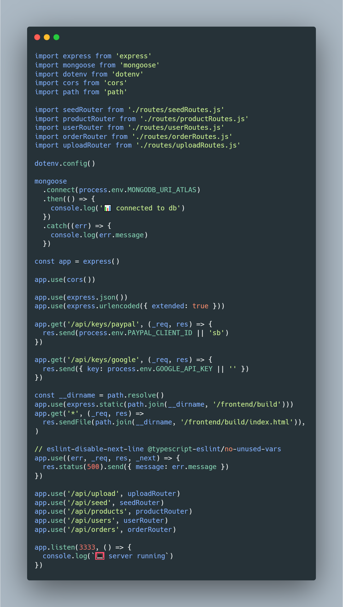
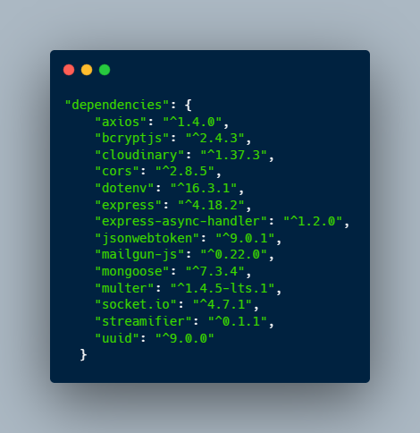

<div align="center" id="top">
  <h1>🚧 Em Construção 🚧</h1>
</div>

<h3 align="center">API-delivery</h3>

Api para delivery, o cliente vai poder fazer seu registro na plataforma e fazer pedido, e realizar pagamento

## Índice

- [Recursos](#recursos)
- [Instalação](#instalação)
- [Sobre](#uso)
- [Contribuição](#contribuição)
- [Contato](#contato)

## Recursos

Principais recursos e funcionalidades do projeto.

- Adicionar, atualizar e remover produtos.
- Avaliação e comentários dos clientes.
- Realizar pagamento usando Paypal, cartão de crédito e débito.

## Instalação

OS X & Linux:

1. Clonar o repo
   ```sh
   git clone https://github.com/ElvisFelix-dev/api-delivery
   ```
2. Abra a pasta
   ```sh
   cd api-delivery

3. Instalando NPM packages
   ```sh
   npm install
   ```

4. Iniciar
   ```sh
   npm run dev
   ```

## Sobre

<div align="center">
  <br />
  <br />
</div>

<p>
  Aplicação desenvolvida com Javascript, usando NodeJS
</p>

</br>
<p>
  Libs usadas no projeto
</p>
</br>
<div align="center">
  <br />
  <br />
</div>


## Contribuição

1. Fork it (<https://github.com/ElvisFelix-dev/api-delivery/fork>)
2. Create your feature branch (`git checkout -b feature/delivery`)
3. Commit your changes (`git commit -am 'Add some delivery'`)
4. Push to the branch (`git push origin feature/delivery`)
5. Create a new Pull Request

## Contato

<p align="center"><a href="https://www.linkedin.com/in/elvis-felix" target="blank"></a></p>


<p align="right">(<a href="#topo">Para o topo</a>)</p>

